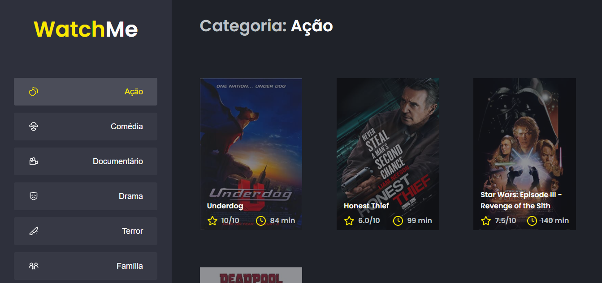
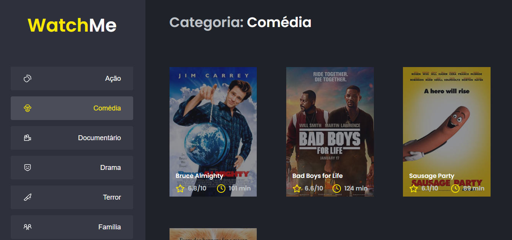

# Projeto de lista de filmes

### Feito de acordo com o projeto proposto, do desafio do IGNITE trilha React

## Objetivo do projeto:

## Utilizar uma API, mostrando os filmes de acordo com a categoria escolhida

### - Selecionar a categoria

### - Mostrar os filmes de acordo com a categoria

## Como funciona:

### - O usuário pode sewlecionar a categoria

### Para utilizar terá que baixar as dependências do projeto:

## - npm install ou yarn install

